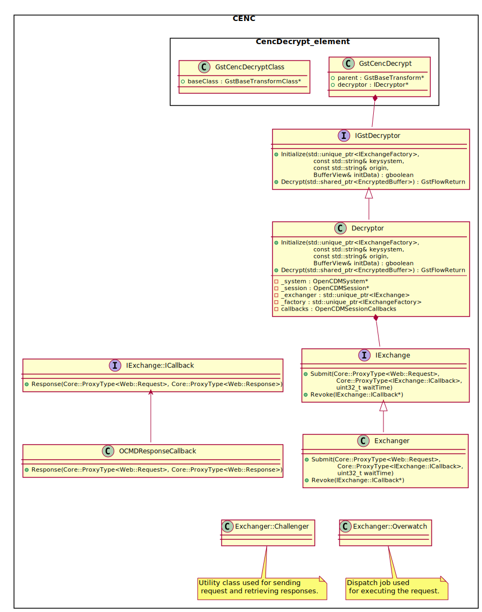

# gstcencdecryptor
:fireworks: Gstreamer plugin to satisfy all your basic cenc decryption needs. :fireworks:
## Milestones
- [x] Clear content passthrough
- [x] Decryption of content with a single encrypted stream 
- [ ] Decryption of sources with multiple encrypted streams
- [ ] Useable as a standalone gstreamer plugin (with gst-launch)
## Overview
### Capabilities
This plugin's main purpose is to provide a minimal working example of content decryption on an arbitrary platform. Element's current capabilites are as follows:
```
  SRC template: 'src'
    Availability: Always
    Capabilities:
      video/mp4
      audio/mp4
      audio/mpeg
      video/x-h264

  SINK template: 'sink'
    Availability: Always
    Capabilities:
      application/x-cenc
        original-media-type: video/mp4
        protection-system: 9a04f079-9840-4286-ab92-e65be0885f95
      application/x-cenc
        original-media-type: audio/mp4
        protection-system: 9a04f079-9840-4286-ab92-e65be0885f95
      application/x-cenc
        original-media-type: audio/mpeg
        protection-system: 9a04f079-9840-4286-ab92-e65be0885f95
      application/x-cenc
        original-media-type: video/x-h264
        protection-system: 9a04f079-9840-4286-ab92-e65be0885f95
      application/x-cenc
        original-media-type: video/mp4
        protection-system: edef8ba9-79d6-4ace-a3c8-27dcd51d21ed
      application/x-cenc
        original-media-type: audio/mp4
        protection-system: edef8ba9-79d6-4ace-a3c8-27dcd51d21ed
      application/x-cenc
        original-media-type: audio/mpeg
        protection-system: edef8ba9-79d6-4ace-a3c8-27dcd51d21ed
      application/x-cenc
        original-media-type: video/x-h264
        protection-system: edef8ba9-79d6-4ace-a3c8-27dcd51d21ed
```
In other words - h.264 content encrypted with widevine or playready keysystems. The *OpenCDM* implementation additionally requires for an [*OpenCDM server*](https://github.com/rdkcentral/ThunderNanoServices/blob/master/OpenCDMi/doc/OpenCDMiPlugin.md) to be runnning on the platform. 

### Extension points
Interfacing with a different CDMi system is possible, if a suitable implementation is provided. In order to roll your own implementation of the decryption process, you should extend these interfaces:
- IExchange & IExchange::ICallback
- IExchangeFactory
- IGstDecryptor

Their functionality in the whole scope of a system can be presented in a form of a UML diagram:


If you would like to provide your own implementation for these files you should extend the `/CMakeLists.txt` file:
```cmake
# ...
if(${DECRYPTOR} STREQUAL "ocdm")
    add_subdirectory(${CMAKE_CURRENT_SOURCE_DIR}/ocdm)
elseif(${DECRYPTOR} STREQUAL "MySuperAwesomeDecryptor") 
    add_subdirectory(${CMAKE_CURRENT_SOURCE_DIR}/MySuperAwesomeDecryptor)
else()
    message(SEND_ERROR "No valid decryptor selected")
endif()
# ...
``` 
Then, in `MySuperAwesomeDecryptor` provide implementations for the aforementioned interfaces and build them as a static library. For a reference you can use the `/ocdm/CMakeLists.txt` file.

